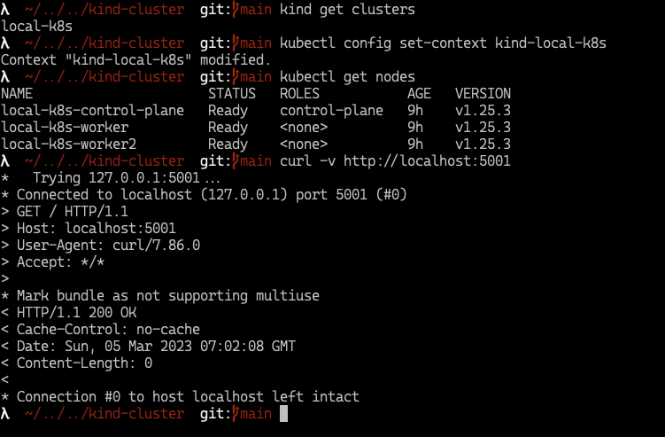
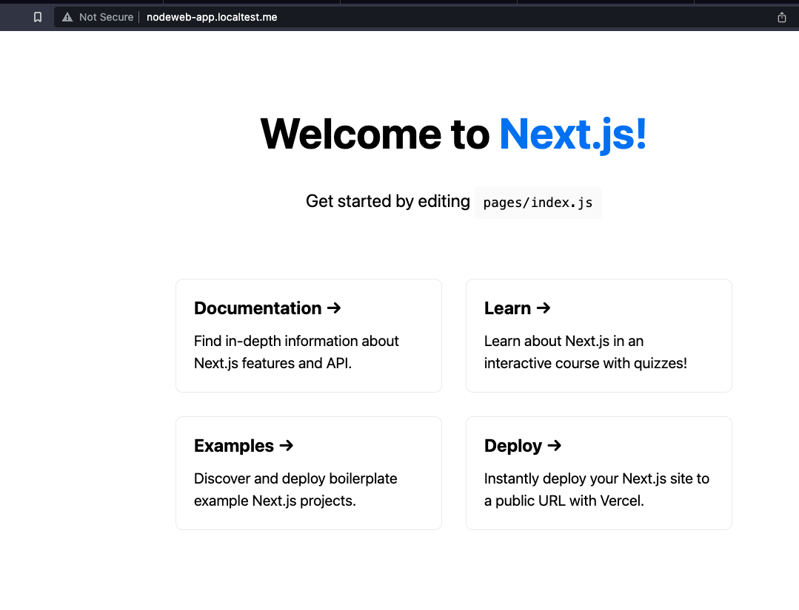
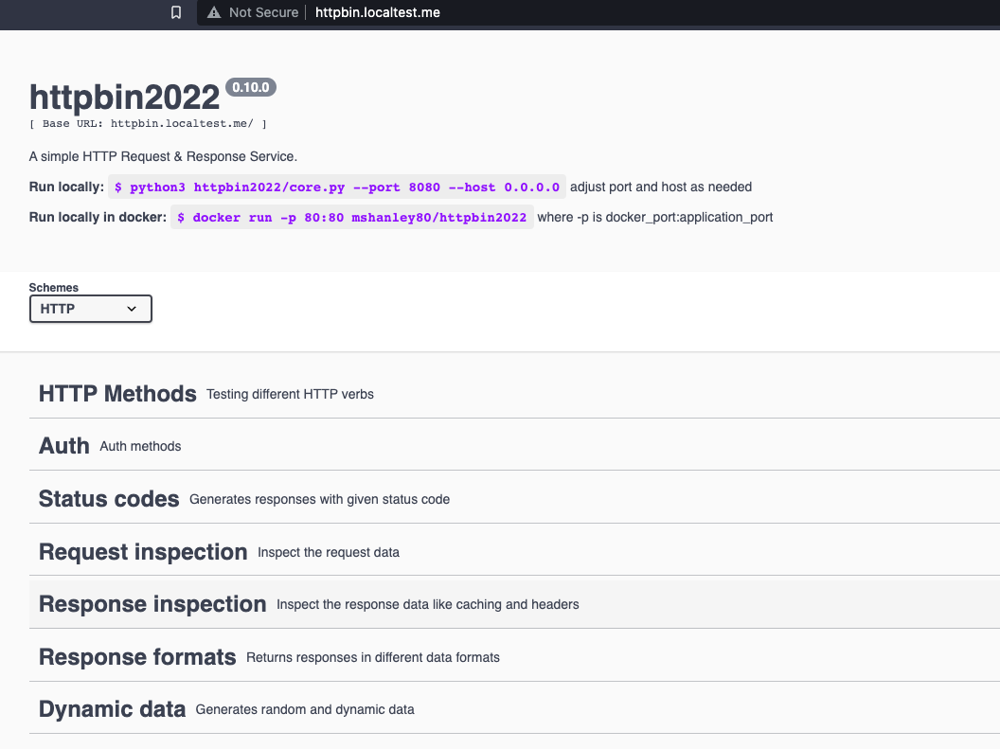

# Kind : Local k8s cluster with Ingress and Registry support

*Instructions are specific to MacOS Apple Silicon, should work for other OS (use OS specific way to install pre-requisites)*

## Prerequisites

- [Optional] Install [Homebrew](https://brew.sh/)
- Install [Docker](https://docs.docker.com/get-docker/) on your machine
- Install [Kubectl](https://kubernetes.io/docs/tasks/tools/install-kubectl-macos/)

    ```
    # if you have homebrew installed
    brew install kubectl
    ```

- Install [Kind](https://kind.sigs.k8s.io/docs/user/quick-start/#installation)

    ```
    # if you have homebrew installed
    brew install kind
    ```

## Installation

- Run `make create-cluster clustername=<your local cluster name>`
- creates 
  - multi-node cluster 
  - configures ingress controller
  - configures dns
  - configures local registry on port 5001

### Basic Validation

- `kind get clusters` , should list cluster with name 'kind-<cluster-name>'
- `curl -v http://localhost:5001` , should return 200 Ok
- `kubectl config set-context kind-<cluster-name>` should switch kube context to the <cluster-name> ( *Note: you have to prefix 'kind-' to the actual cluster name you created* )
- `kubectl get nodes`, should return multi node local cluster with ingress controller



### Ingress Validation

- Run `make test-ingress`
  - builds docker image for sample application
  - pushes it to local kind registry
  - deploys sample web application to the local kind k8s cluster accessible through the ingress at http://nodeweb-app.localtest.me
    
  - deploys httpbin pulled from dockerhub to the local kind k8s cluster accessible through the ingress at http://httpbin.localtest.me
    
