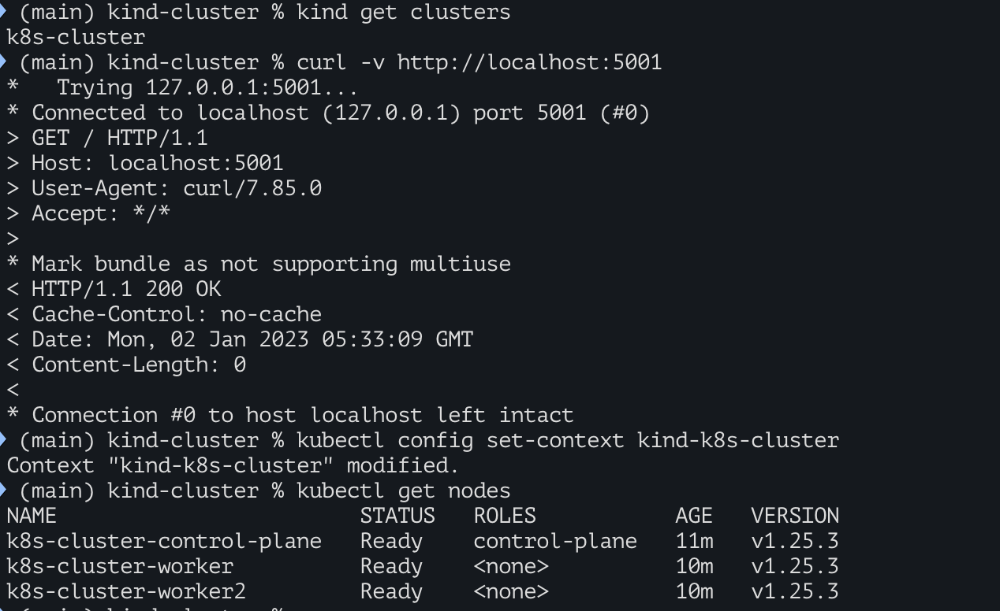
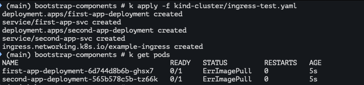
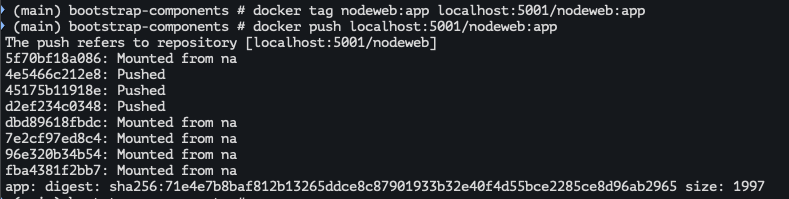
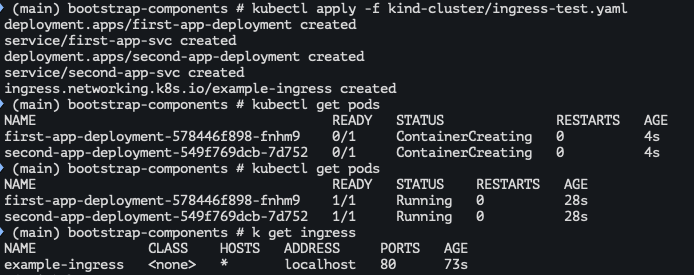
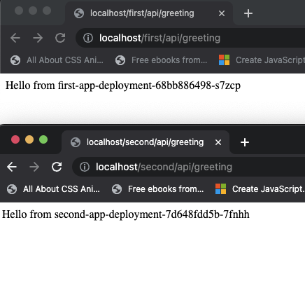

# Kind : Local k8s cluster with Ingress and Registry support

*Instructions are specific to MacOS Apple Silicon, should work for other OS (use OS specific way to install pre-requisites)*

## Prerequisites

- [Optional] Install [Homebrew](https://brew.sh/)
- Install [Docker](https://docs.docker.com/get-docker/) on your machine
- Install [Kubectl](https://kubernetes.io/docs/tasks/tools/install-kubectl-macos/)

    ```
    # if you have homebrew installed
    brew install kubectl
    ```

- Install [Kind](https://kind.sigs.k8s.io/docs/user/quick-start/#installation)

    ```
    # if you have homebrew installed
    brew install kind
    ```

## Installation

- Run `make create-cluster`
- creates a multi-node cluster with ingress controller that also hosts local-registry

### Basic Validation

- `kind get clusters` , should list cluster with name 'kind-k8s-cluster'
- `curl -v http://localhost:5001` , should return 200 Ok
- `kubectl config set-context kind-k8s-cluster` should switch kube context to the k8s-cluster ( *Note: you have to prefix 'kind-' to the actual cluster name you created* )
- `kubectl get nodes`, should return multi node local cluster with ingress controller



### Ingress Validation

- Let's validate ingress by deploying ingress-test.yaml with a local docker image
  

- If you see an 'ErrImagePull' error, it is due to the fact that the local images in your docker registry are not accessible to the kind cluster.

- You will need to tag the image and push it to the kind cluster's own registry that we have setup on 'localhost:5001'
  

  NOTE: You will have this error only if you are using locally built image in the ingress-test.yaml.

- Now let's deploy ingress-test.yaml again
  

- You should see that requests going to different containers based on the url
  